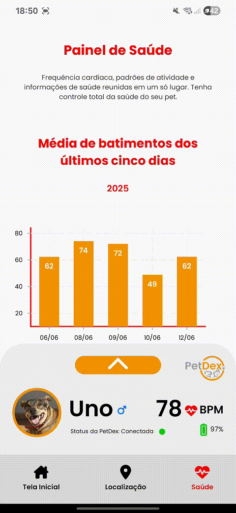

  

# PetDex

Repositório do **Grupo 07** do Projeto Interdisciplinar do **4º semestre** do curso de **Desenvolvimento de Software Multiplataforma - DSM** (Turma 2025/1).

## 👨‍💻 Integrantes

-   **Felipe Avelino Pedaes**
-   **Gabriel Resende Spirlandelli**
-   **Henrique Almeida Florentino**
-   **Luiz Felipe Vieira Soares**

## 🔗 Acesso ao Projeto

* **💻 Aplicação Web:** [https://petdex-puce.vercel.app/welcome](https://petdex-puce.vercel.app/welcome)
* **🐍 Documentação da API de Análise (Python):** [https://api-petdex-estatistica.onrender.com/docs](https://api-petdex-estatistica.onrender.com/docs)
* **☕ Documentação da API Principal (Java):** [https://dsm-p4-g07-2025-7.onrender.com/swagger](https://dsm-p4-g07-2025-7.onrender.com/swagger)

## 📖 Sobre o Projeto

O **PetDex** é uma solução completa para o monitoramento da saúde e segurança de pets. Desenvolvemos uma **coleira inteligente** equipada com sensores que coletam dados vitais, como **batimentos cardíacos**, e  a **localização do animal via GPS**.

  

  
  

As informações são enviadas para um sistema integrado, acessível através de uma **plataforma web** e um **aplicativo móvel**, onde o dono pode acompanhar a saúde e a localização do seu pet em tempo real. O projeto também inclui uma API de análise de dados que fornece estatísticas, correlações e até previsões sobre a frequência cardíaca do animal com base em seus movimentos.

Para a validação do projeto, foi criado um protótipo 3D e realizamos testes de coleta de dados reais com nosso Pet chamado Uno.

## 📱 Nossa Plataforma

A plataforma PetDex, disponível em versão web e mobile, oferece uma experiência completa para o usuário acompanhar seu pet de onde estiver. Com uma interface intuitiva, é possível acessar dados vitais e a localização em tempo real.

### **Funcionalidades**

  

  <em><b>Tela Inicial:</b> Tenha acesso rápido à última localização registrada e ao batimento cardíaco mais recente do seu pet. Um gráfico inferior exibe a média dos batimentos das últimas cinco horas.</em>

---

  

  <em><b>Localização em Detalhes:</b> Visualize o endereço exato onde seu animal de estimação está localizado no mapa.</em>

---

  

  <em><b>Monitoramento de Saúde:</b> Acesse um dashboard completo com a média de batimentos dos últimos cinco dias e análises estatísticas detalhadas, incluindo média, moda, mediana, desvio padrão, assimetria e curtose da frequência cardíaca.</em>

---

### **Análises Avançadas no App**

O aplicativo também conta com ferramentas de análise de dados para previsões e insights sobre a saúde do seu pet.

  
  

  <em><b>Consultas Específicas:</b> Verifique a média de batimentos em uma data específica e calcule a probabilidade de uma determinada frequência cardíaca ocorrer.</em>

---

  

  <em><b>Previsão de Frequência Cardíaca:</b> Utilize a análise de regressão e correlação, que cruza os dados de frequência cardíaca com os de movimento (acelerômetro), para prever os batimentos futuros do animal.</em>

## 🛠️ Tecnologias Utilizadas

O projeto foi construído com uma arquitetura de microsserviços e tecnologias modernas, divididas nas seguintes frentes:

### **Hardware (IoT)**

* **Microcontrolador:** ESP32 S3 Zero
* **Sensores:** GPS (NEO6MV2), Monitor Cardíaco (MAX30102), Acelerômetro e Giroscópio (MPU6050)
* **Prototipagem:** Modelo 3D para o case da coleira

### **Backend**

* **API Principal (Java/Spring Boot):** Responsável pela comunicação com o banco de dados e o hardware. Utiliza **Swagger** para documentação.
* **API de Análise (Python/Flask):** Realiza análises estatísticas (média, moda, mediana), regressão/correlação de dados e previsão de frequência cardíaca.
* **Banco de Dados:** MongoDB

### **Frontend**

* **Aplicação Web:** Next.JS
* **Aplicativo Móvel:** React Native

---

> Projeto desenvolvido como parte das atividades acadêmicas da **FATEC** – Faculdade de Tecnologia.